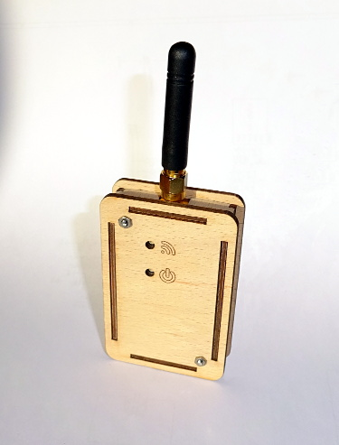

# ism-gateway
A simple radio (434 MHz, ISM band) to USB gateway

## Firsts
The most exciting part of every project, are the things I have never done before.
This is a list of things that were new to me with this project:

  * USB (A/B micro connector, power and data)
  * RGB LEDs
  * LED controller with custom protocol
  * custom housing

## Housing
I had the housing laser cut from 2 mm plywood.
I assumed 0.1 mm of kerb, which worked fine for the most part.
The material seemed to be somewhat thicker than the advertised 2 mm or maybe just uneven.
Therefore, I had to file down side walls to make them fit into the holes of the top and bottom covers.
The cut-outs for the antenna, usb connector, LED, and threaded rods fit perfectly.
The case is held together by two threaded rods (M2) at opposite corners and fixed with nuts.
The rods also run through the mounting holes of the PCB.
Additional nuts are used to hold the PCB in place.

### Learnings
  * plywood cases look quite ok
  * 0.1 mm kerb is ok for 2 mm plywood
  * plywood is not necessarily exactly the nominal thickness
  * a metal file would be good to smooth the metal rod cut-faces

## Firmware
The firmware is based on code generated by the recommended STM tools.
I wrote custom drivers for the LED driver and the RFM98 module.
These drivers are able to operate in blocking or interrupt mode, depending on the functions provided by the calling code.

The LED driver is used in interrupt mode, currently.
The RFM98 is polled to check for newly received messages.

### Ideas for improvement
  * the USB interrupts should be prioritized over the LED driver interrupts
  * interrupts should be used to check for received messages from the RFM98 module
  * USB messages should only be sent, if there is a receiver attached

## License
To all the parts that I developed, the MIT license applies.
Parts from third parties (e.g. generated code) may have other license restrictions.
